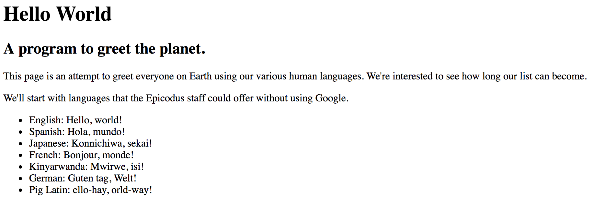

# Hello World

#### _By Kaila Goff & Maggie Summers_

#### _Our First HTML application. Hello, World. 1-2-18_

## Description

_Simple HTML page displaying Hello World, as well as an unordered list of programming languages that Epicodus teaches._

<kbd></kbd>

## Setup/Installation Requirements

* _Clone this repository_

* _Open hello-world.html in web browser._

## Known Bugs

  * _No known bugs at this time._

## 📧 Support and contact details

  _To suggest changes, submit a pull request in the GitHub repository._

## Technologies Used

  * HTML

### License

  *MIT License*

Copyright (c) 2018 **_Kaila Goff & Maggie Summers_**
